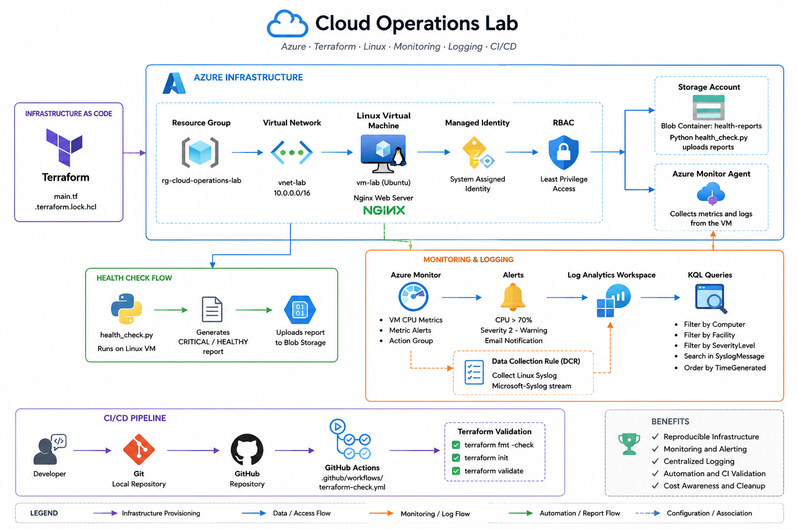
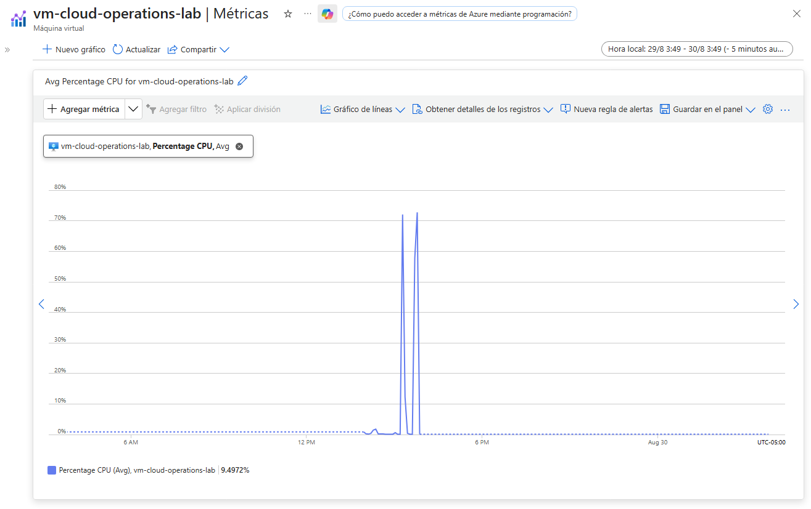
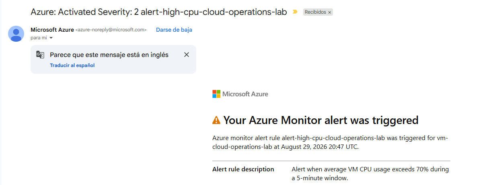
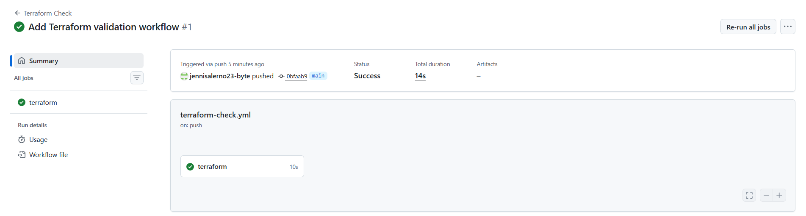

# Cloud Operations Lab

A hands-on cloud operations project built on Microsoft Azure to practice infrastructure provisioning, Linux administration, automation, monitoring, troubleshooting, identity, observability, containers, and CI validation.

The lab was designed around an operational workflow rather than isolated exercises: provision infrastructure, deploy a service, monitor it, generate incidents, investigate failures, automate health checks, validate infrastructure as code, and clean up resources after testing.

## Project Overview

This project simulates a small cloud operations environment using Azure and Terraform.

The goal was to build a reproducible infrastructure and then operate it through realistic scenarios involving Linux services, networking, identity and access management, monitoring, centralized logging, automation, and troubleshooting.

The environment was intentionally created and destroyed repeatedly to reinforce Infrastructure as Code practices and control cloud costs.

## Technologies

- Microsoft Azure
- Terraform
- Linux (Ubuntu)
- Python
- Nginx
- Azure Monitor
- Log Analytics
- Azure Monitor Agent
- Kusto Query Language (KQL)
- Azure Managed Identity
- Azure RBAC
- Azure Blob Storage
- Git
- GitHub
- GitHub Actions
- Docker

## Prerequisites

Before using this lab, make sure you have:

- An active Azure subscription
- Terraform installed
- Azure CLI installed and authenticated
- Git installed
- An SSH key pair available at `~/.ssh/id_rsa` and `~/.ssh/id_rsa.pub`
- Permission to create Azure resources and role assignments

The lab was developed and tested using Azure Cloud Shell and Ubuntu Linux.

## Configuration

Before deploying the lab, provide the required Terraform variables:

| Variable | Purpose |
|---|---|
| `ssh_source_address_prefix` | CIDR allowed to connect to the VM through SSH. Example: `203.0.113.10/32`. |
| `storage_account_name` | Globally unique Azure Storage Account name. |

Example:

```bash
terraform apply \
  -var="ssh_source_address_prefix=YOUR_PUBLIC_IP/32" \
  -var="storage_account_name=YOUR_UNIQUE_STORAGE_ACCOUNT"
```

The Python health check reads the Storage Account name from an environment variable:

```bash
export STORAGE_ACCOUNT_NAME="YOUR_UNIQUE_STORAGE_ACCOUNT"
python3 health_check.py
```

`STORAGE_CONTAINER_NAME` is optional and defaults to `health-reports`.

> Local `.tfvars`, environment files, and private key files are excluded from version control through `.gitignore`.

## Architecture



## Infrastructure

Terraform provisions the core Azure environment used throughout the lab:

- Resource Group
- Virtual Network and Subnet
- Network Security Group
- SSH and HTTP security rules
- Public IP Address
- Network Interface
- Ubuntu Linux Virtual Machine
- System-Assigned Managed Identity
- Azure Storage Account
- Private Blob Container
- RBAC role assignment
- Log Analytics Workspace
- Azure Monitor Agent
- Data Collection Rule
- Data Collection Rule association

The infrastructure was repeatedly created, validated, modified, and destroyed using Terraform to reinforce reproducibility and lifecycle management.

## Operational Scenarios

The lab included controlled operational and troubleshooting scenarios rather than only resource deployment.

### Linux service troubleshooting

Nginx was installed and operated as a real service. Tests included:

- Stopping and restarting the service
- Verifying service state with `systemctl`
- Checking listening ports
- Testing HTTP availability with `curl`
- Reviewing service logs with `journalctl`
- Changing the Nginx listening port to simulate a configuration issue

### CPU monitoring and alerting

High CPU usage was generated intentionally on the VM.

Azure Monitor was used to:

- Observe CPU metrics
- Detect sustained CPU usage above 70%
- Trigger a Severity 2 alert
- Send an email notification through an Action Group
- Automatically resolve the alert after CPU usage returned to normal

### Authorization failure

The VM used a System-Assigned Managed Identity to upload health reports to Azure Blob Storage.

The RBAC assignment was intentionally removed to generate an HTTP `403 AuthorizationPermissionMismatch` error.

Restoring the `Storage Blob Data Contributor` role restored access without changing credentials.

### Terraform drift

The HTTP NSG rule was manually changed in the Azure Portal from port `80` to `8080`.

`terraform plan` detected the drift and proposed an in-place correction back to the declared configuration.

`terraform apply` restored the desired state successfully.

## Security and Identity

Security was implemented using Azure-native identity and access controls.

### Managed Identity

The Linux VM uses a System-Assigned Managed Identity instead of storing Azure credentials inside scripts.

The identity was used to request an Azure access token from the Instance Metadata Service (IMDS) and authenticate against Azure Storage.

### RBAC

The VM identity was granted the `Storage Blob Data Contributor` role at the Storage Account scope.

This allowed the VM to upload health reports to the private Blob Container without using storage account keys or connection strings.

### Network access

SSH access was restricted in the Network Security Group to the current Cloud Shell public IP using a `/32` source prefix.

HTTP access was intentionally exposed for the web service during testing.

> Authentication answers **who the identity is**, while authorization determines **what that identity is allowed to do**.

## Monitoring and Observability

The lab combined platform metrics with centralized Linux logs.

### Azure Monitor

Azure Monitor was used to observe VM CPU utilization and create a metric-based alert.

The alert configuration included:

- Signal: `Percentage CPU`
- Aggregation: Average
- Threshold: Greater than 70%
- Evaluation frequency: 1 minute
- Lookback window: 5 minutes
- Severity: 2 - Warning

An Action Group delivered email notifications when the alert was triggered and when the condition automatically resolved.

### Validation evidence

CPU load captured by Azure Monitor during the controlled test:



The configured alert was triggered after the CPU threshold was exceeded:



### Log Analytics

Linux Syslog events were centralized in a Log Analytics Workspace using:

- Azure Monitor Agent
- Data Collection Rule
- Data Collection Rule association
- Selected Syslog facilities and severity levels

### KQL

Kusto Query Language (KQL) was used to investigate centralized logs.

Queries were used to:

- Filter events by VM
- Filter by Syslog facility
- Search by severity
- Find test messages
- Investigate Nginx stop and start events

This demonstrated the operational difference between metrics and logs:

> **Metrics help detect that something is wrong. Logs help investigate what happened.**

## Automation

A Python health check script was created to evaluate the operational state of the VM.

The script checks:

- Nginx HTTP availability
- Disk usage
- Memory usage
- Overall health status

Health states were classified as:

- `HEALTHY`
- `WARNING`
- `CRITICAL`

The script also obtains an Azure access token using the VM Managed Identity and uploads timestamped health reports to the private Blob Container.

This allowed the health check to report service issues independently from Azure Monitor alerts.

## CI

GitHub Actions was used to validate the Terraform configuration automatically.

The workflow runs when:

- Terraform files change
- The workflow file itself changes
- The workflow is started manually with `workflow_dispatch`

The validation pipeline performs:

- Repository checkout
- Terraform setup
- `terraform init -backend=false`
- `terraform fmt -check`
- Temporary SSH key generation
- `terraform validate`

The first CI run failed because the GitHub runner did not contain the local SSH public key expected by the Terraform configuration.

A temporary SSH key generation step was added to remove that local-environment dependency, and the following workflow run completed successfully.

> CI helped identify a dependency that worked locally but was missing in a clean execution environment.

### Validation evidence

GitHub Actions successfully validated the Terraform configuration in a clean runner environment:



## Cost Control

The lab followed a short-lived resource strategy:

`create` → `practice` → `validate` → `destroy`

Resources were destroyed after each major session to avoid unnecessary Azure charges.

A monthly Azure budget and cost alerts were configured before beginning the project.

The total observed lab cost remained below USD 1 while practicing with virtual machines, networking, storage, monitoring, logging, and other Azure services.

> Azure Cost Management data can be delayed, so final charges may appear after resources have already been destroyed.

## Repository Structure

```text
cloud-operations-lab/
├── .github/
│   └── workflows/
│       └── terraform-check.yml
├── docs/
│   ├── DAY-03-NOTES.md
│   ├── DAY-04-NOTES.md
│   └── DAY-05-NOTES.md
├── images/
│   ├── architecture.png
│   ├── azure-monitor-alert.png
│   ├── azure-monitor-cpu.png
│   └── terraform-ci-success.png
├── .gitignore
├── .terraform.lock.hcl
├── COMMANDS.md
├── README.md
├── health_check.py
└── main.tf
├── terraform.tfvars.example
```

- `main.tf` contains the Azure infrastructure definition.
- `health_check.py` contains the operational health check and Blob upload logic.
- `COMMANDS.md` provides a quick command reference for the tools practiced in the lab.
- `images/` contains the architecture diagram and validation screenshots used in the documentation.
- `docs/` contains the implementation and troubleshooting notes for Days 3, 4, and 5.
- `.github/workflows/terraform-check.yml` contains the GitHub Actions Terraform validation workflow.
- `.terraform.lock.hcl` pins the Terraform provider dependency selections.
- `terraform.tfvars.example` provides placeholder values for the required Terraform variables.

## Key Learnings

The project reinforced several practical cloud operations concepts:

- Infrastructure as Code enables repeatable provisioning and cleanup.
- Terraform configuration represents the desired state of infrastructure.
- Manual changes can introduce drift that Terraform can detect and correct.
- Linux service health requires validating more than whether a process is running.
- Managed Identity avoids storing Azure credentials in application code.
- RBAC separates authentication from authorization.
- Metrics and logs serve different but complementary operational purposes.
- Centralized logging makes troubleshooting possible without relying only on direct VM access.
- CI can expose hidden dependencies that are not obvious in a local environment.
- Cloud resources should be intentionally created, monitored, and destroyed to control cost.

## Command Reference

A practical command reference for Terraform, Linux, Azure CLI, Git/GitHub, Docker, and KQL is available in [COMMANDS.md](COMMANDS.md).

## Status

**Completed**

The technical objectives of the lab were implemented and validated successfully.

All Terraform-managed Azure resources were destroyed after testing to avoid unnecessary ongoing costs.

The repository remains available as a reproducible reference for future cloud operations practice.
